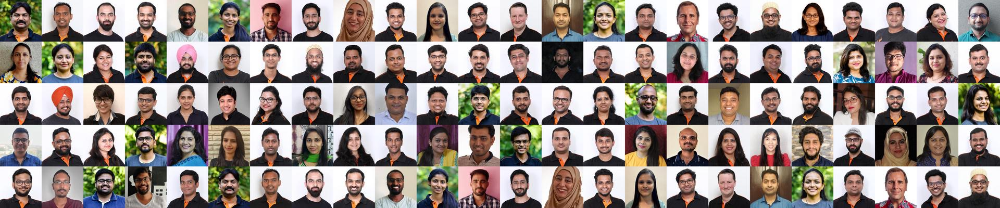

# GoCollage
> Generate collage using Go

## Setup
- Clone the repository
- run go get
- run `go run main.go`

## Deploy
- To deploy connect the repository with [Vercel](https://vercel.app).

## Usage
- By default the image is of width 1920px and colored. However to change the
  width and color you can pass the following query parameters:
  - `gray=true` to convert to the image to grayscale.
  - `width=900` to resize the width to 900px. The height will automatically
    maintain the aspect ratio.
- Base URL and the image on the page can be configurable using query parameters.
  - `url=https://www.axelerant.com`
  - `image=
\s+<img src="(.+jpg)\?.+" width="300`

## Screenshots
##### Web UI

##### Default Settings: Colored and 1920px wide image

##### Resize image

##### Grayscale image

### Info

- [Twitch](https://www.twitch.tv/skippednote)
- [Twitter](https://www.twitter.com/skippednote)
- [GitHub](https://www.github.com/skippednote)

